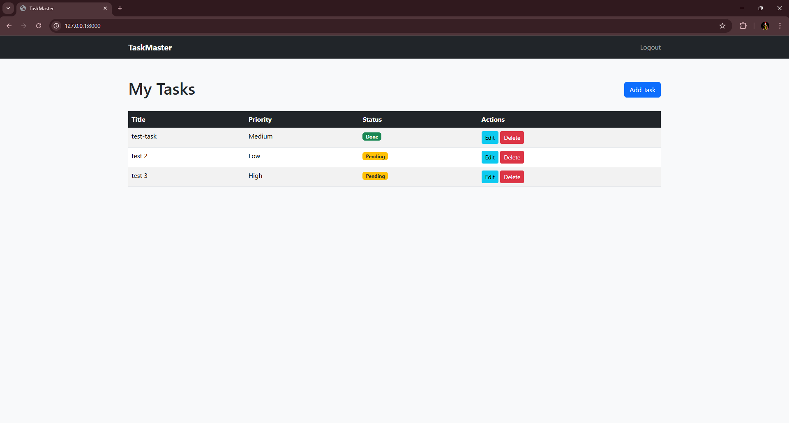
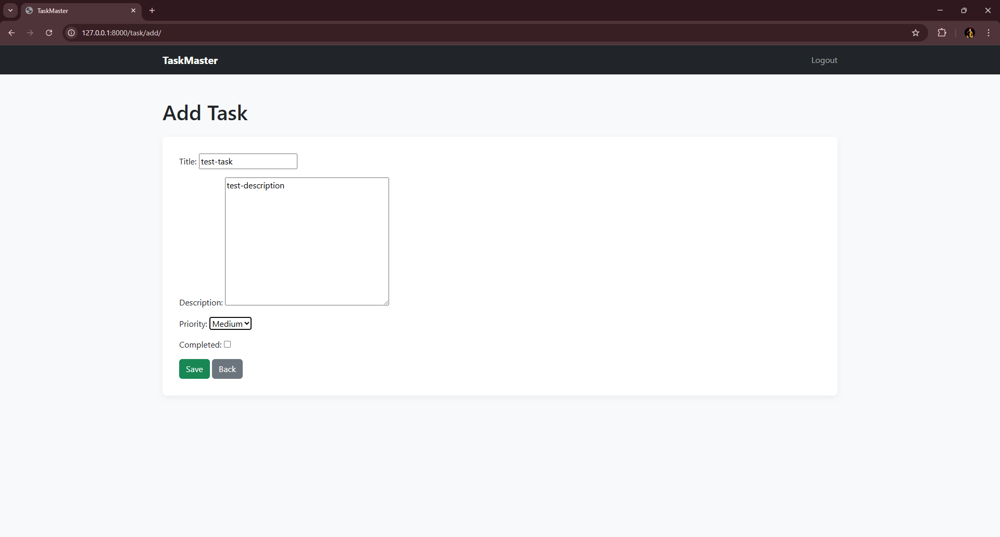
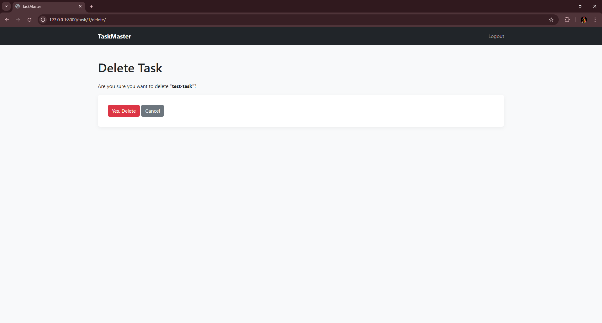
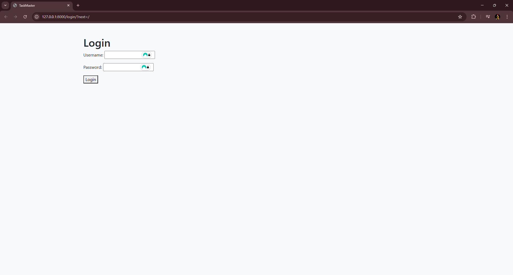

# TaskForge

  

TaskMaster is a task management web application built with Python and Django, featuring user authentication, task CRUD functionality, and a clean, responsive UI using Bootstrap 5.
The project is designed as a learning-focused full-stack Django application and a base for further feature expansion.

## 🛠 Features

- **User Authentication:** Secure login and logout (POST-based logout).  
- **Task Dashboard:** View all tasks belonging to the logged-in user.  
- **CRUD Operations:** Create, edit, and delete tasks.
- **Access Control:** Users can only view and modify their own tasks.  
- **Responsive UI:** Built with Bootstrap 5 and custom CSS.  
- **Admin Panel:** Manage users and tasks via Django Admin.  
- **Clean Code Structure:** Separation of models, views, forms, templates, and static files.  

## 📸 Screenshots

- **Dashboard:** 
- **Add Task:**  
- **Delete Confirmation:**  
- **Login Page:**  

## 🚀 Installation & Setup

### Create a virtual environment

```bash
python -m venv venv
source venv/bin/activate  # On Windows: venv\Scripts\activate
```

### Install dependencies

```bash

pip install django
```

### Apply migrations

```bash


python manage.py migrate

```

### Create a superuser (for admin access)

```bash
python manage.py createsuperuser
```

### Run the development server

```bash
python manage.py runserver
```

### Access the app

App: http://127.0.0.1:8000/

Admin: http://127.0.0.1:8000/admin/

## ⚡ Usage

- Login with your user credentials.
- Add tasks with title, priority, and status.
- Edit or delete tasks directly from the dashboard.
- Tasks are scoped per user
- Logout securely via the navbar button.

## 🧩 Project Structure

```bash tree
taskmaster/
├── manage.py
├── taskmaster/        # Project configuration
│   ├── settings.py
│   ├── urls.py
│   ├── asgi.py
│   └── wsgi.py
├── tasks/             # Main application
│   ├── templates/tasks/
│   │   ├── base.html
│   │   ├── dashboard.html
│   │   ├── task_form.html
│   │   ├── task_confirm_delete.html
│   │   └── login.html
│   ├── static/tasks/css/styles.css
│   ├── models.py
│   ├── views.py
│   ├── forms.py
│   ├── urls.py
│   └── admin.py
```

## 🎨 Technologies Used

- Python 3.12
- Django 6.0
- Bootstrap 5
- SQLite (default database)
- HTML / CSS / Django Templating

## 💡 Learning Outcomes / Skills Showcased

- Full-stack Django development
- Authentication and authorization
- CRUD workflows
- Django migrations and project configuration
- Responsive web design with Bootstrap
- Template inheritance and static files hadnling
- Debugging and improving existing codebases
- Project structuring for maintainable code

## 📌 Notes

- This project is intended for development and learning purposes.

## 📁 Possible Next Improvements

- Add task categories and deadlines
- Implement search and filtering
- Add user registration
- Upgrade to a supported Django LTS version
- Deploy to Heroku or Render for live demo

## ⚖ License

This project is licensed under the MIT License. See the LICENSE file for details.
